# Guía Funcional y Anti-Detección — Gestión de Sesiones de Navegador

> Documento didáctico que explica **cómo funciona** el sistema, **qué cubre** para evitar
> que Google detecte/banee la cuenta o pida re-verificación, **qué no cubre** (y por qué), y
> **lo que NO debes hacer**. Incluye diagramas, mapas de cobertura y recomendaciones.

---

## Tabla de contenidos

1. [¿Qué problema resuelve? (El "por qué")](#1-qu%C3%A9-problema-resuelve-el-por-qu%C3%A9)
2. [Arquitectura general (el mapa)](#2-arquitectura-general-el-mapa)
3. [El servidor (PC central) — paso a paso](#3-el-servidor-pc-central--paso-a-paso)
4. [El cliente (PC remota) — paso a paso](#4-el-cliente-pc-remota--paso-a-paso)
5. [El chat con Gemini — cómo funciona](#5-el-chat-con-gemini--c%C3%B3mo-funciona)
6. [El enfoque híbrido (por qué solo cookies no bastan)](#6-el-enfoque-h%C3%ADbrido-por-qu%C3%A9-solo-cookies-no-bastan)
7. [Cómo no ser detectado por Google](#7-c%C3%B3mo-no-ser-detectado-por-google)
8. [Cobertura anti-detección (qué cubrimos)](#8-cobertura-anti-detecci%C3%B3n-qu%C3%A9-cubrimos)
9. [Lo que NO cubrimos (y si se puede cubrir)](#9-lo-que-no-cubrimos-y-si-se-puede-cubrir)
10. [Lo que NO debes hacer (reglas operativas)](#10-lo-que-no-debes-hacer-reglas-operativas)
11. [Gestión de riesgos: ban vs challenge](#11-gesti%C3%B3n-de-riesgos-ban-vs-challenge)
12. [Checklist de operación segura](#12-checklist-de-operaci%C3%B3n-segura)

---

## 1. ¿Qué problema resuelve? (El "por qué")

**El problema**: Tienes una cuenta de Google (con sesión activa en tu PC de trabajo) y quieres
usar esa misma sesión en **otras PCs de tu red LAN** (casa, oficina, otros equipos) **sin
compartir tu contraseña** y **sin que Google sospeche** que son dispositivos distintos.

**¿Por qué no es trivial copiar y pegar el perfil de Chrome?**

| Intento ingenuo | Por qué falla |
|---|---|
| Copiar la carpeta del perfil de Chrome a otra PC | Las **cookies están encriptadas con DPAPI** (ligado al usuario de Windows). En otra PC no se pueden desencriptar → sesión muere. |
| Exportar cookies y pegarlas en otra PC | Google guarda tokens OAuth en **IndexedDB + Service Workers**, no solo en cookies. Sin IndexedDB, Google pide re-login. |
| Abrir Gemini en 2 PCs con la misma cuenta simultáneamente | Google puede ver 2 IPs/huellas distintas → riesgo de "verify it's you". |

**La solución** de este sistema:

1. El **servidor** (PC donde se originó la sesión) desencripta las cookies con DPAPI (porque
   es el mismo usuario de Windows) y comprime el perfil **completo** (incluyendo IndexedDB).
2. Los **clientes** descargan ese perfil + cookies + una huella de navegador idéntica.
3. El cliente lanza Chrome local con el perfil completo + cookies inyectadas + huella →
   Google cree que es el **mismo dispositivo** (aunque sea otra PC física).

---

## 2. Arquitectura general (el mapa)

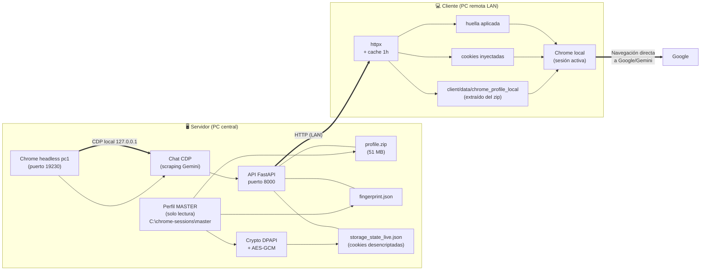

**Línea de fuego**: el único tráfico que sale a Internet es:
- **Cliente → Google** (Gemini, Mail, etc.) — el navegador real del cliente.
- **pc1 (servidor) → Google** — solo para el chat (scraping headless).

La API del servidor (puerto 8000) **solo** se usa dentro de la LAN para que los clientes
descarguen perfil/cookies/huella. No sale a Internet.

---

## 3. El servidor (PC central) — paso a paso

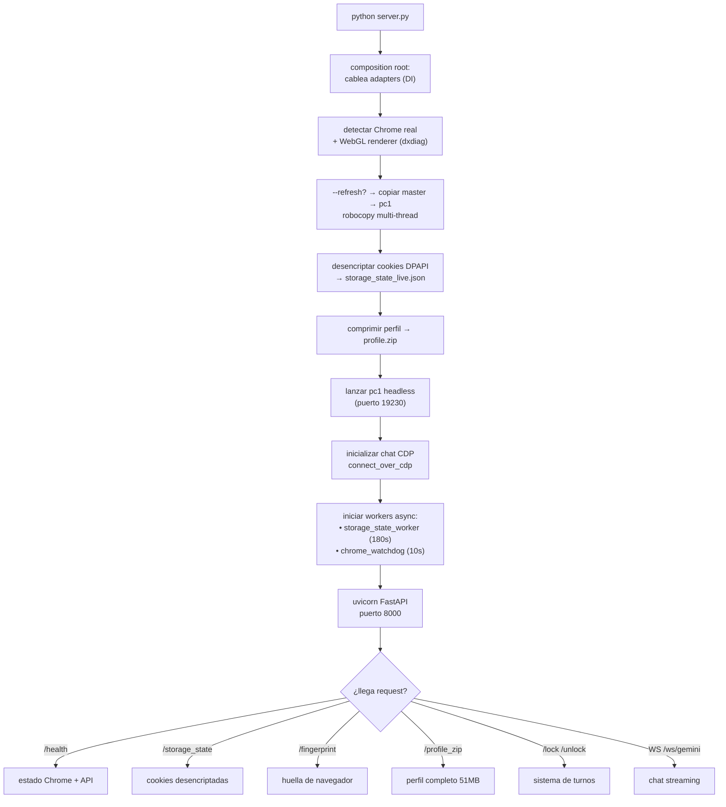

### Componentes clave del servidor

| Componente | Archivo | Qué hace |
|---|---|---|
| **Crypto DPAPI** | `app/infrastructure/crypto/dpapi.py` | Lee `Local State`, desencripta la llave maestra con `CryptUnprotectData` (DPAPI del usuario de Windows). Solo funciona en la PC donde se originó la sesión. |
| **AES-GCM** | `app/infrastructure/crypto/aes_gcm.py` | Desencripta cada cookie (v10/v11). Chrome v127+ añade 32 bytes de SHA-256(host) al inicio → se saltan automáticamente. Backend dual: `pycryptodome` → `cryptography`. |
| **Profile zipper** | `app/infrastructure/profile/profile_zipper.py` | Comprime master → `profile.zip` (51 MB), excluyendo Cache/SW storage/basura. — archivo stale (600s) → regenera. |
| **Fingerprint provider** | `app/infrastructure/fingerprint/provider.py` | Detecta versión real de Chrome + WebGL renderer (vía dxdiag) → `fingerprint.json`. |
| **Chrome watchdog** | `app/application/workers/chrome_watchdog.py` | Loop async cada 10s: si pc1 cae → reinicia. |
| **Storage state worker** | `app/application/workers/storage_state_worker.py` | Loop async cada 180s: re-desencripta cookies (captura tokens renovados por Google). Vía `to_thread` (es DPAPI bloqueante). |
| **Chat CDP** | `app/infrastructure/chat/gemini_cdp_session.py` | Se conecta por CDP a pc1, escribe prompts en Gemini, scrapea el HTML de las respuestas. |

### Por qué master nunca se abre con navegador (por diseño)

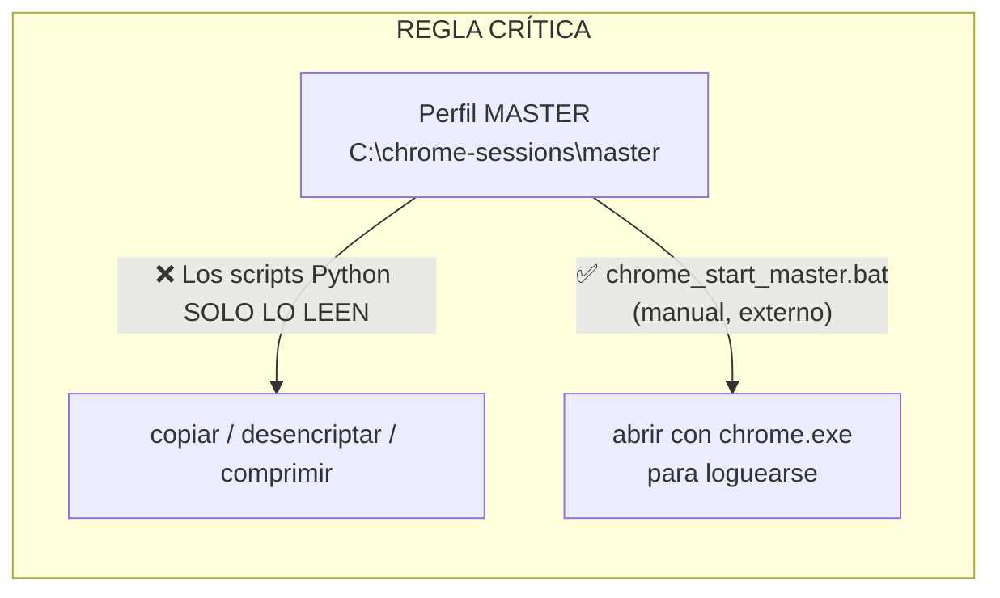

Si un script Python abriera master con un navegador, Chrome crearía un **lock file**
(`SingletonLock`) que impediría que el servidor siguiera leyéndolo. Por eso:
- Los scripts **solo leen** los archivos de master (Cookies DB, Local State, perfil).
- `chrome_start_master.bat` es lo **único** que abre master con chrome.exe — y es manual,
  externo al código, solo para cuando necesitas loguearte por primera vez.

---

## 4. El cliente (PC remota) — paso a paso

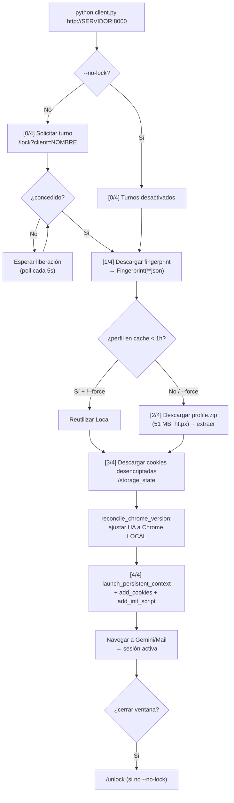

### Por qué el cliente reconcilia la versión de Chrome

El servidor genera `fingerprint.json` con **su** versión de Chrome (ej. v151). Pero el cliente
corre un binario de Chrome **local** que puede ser distinto (ej. v130). Si el UA dice "Chrome 151"
pero el binario real es 130, Google puede correlacionar el **JA3 TLS** (que depende del binario)
con el UA y ver inconsistencia → "dispositivo distinto".

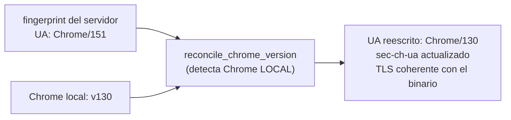

Todo lo demás (WebGL, pantalla, timezone, audio) **se mantiene del servidor** para que todas
las PCs se vean como el mismo dispositivo. Solo la versión de Chrome se ajusta al binario local.

---

## 5. El chat con Gemini — cómo funciona

El chat **no abre el perfil master** (evita conflictos de lock). Se conecta por CDP a la
instancia headless `pc1` que el servidor ya tiene corriendo:

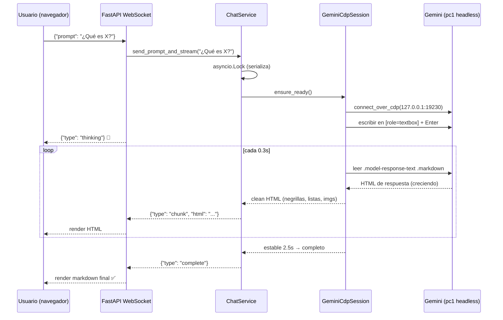

### Por qué el chat usa scraping (y sus limitaciones)

Gemini **no tiene una API pública gratuita** para la sesión web; solo su API de pago (Google AI
Studio / Vertex). Para usar la sesión logueada gratis, el chat hace **scraping del DOM**:

| Lo que se scrapea bien | Lo que se pierde o es frágil |
|---|---|
| Texto con formato (`
`, `<b>`, `<ul>`, listas, tablas) | Tarjetas de lugares (`RICH-LIST-CARD`) — se reconstruyen parcialmente |
| Imágenes (`` con `data-full-size-image-uri`) | Mapas interactivos de Google Maps (no replicables) |
| Indicador de "pensando" | "Side panels" de Gemini |
| Multi-turno (detecta el bloque nuevo por turno) | Si Gemini cambia sus custom elements → se rompe (riesgo residual) |

---

## 6. El enfoque híbrido (por qué solo cookies no bastan)

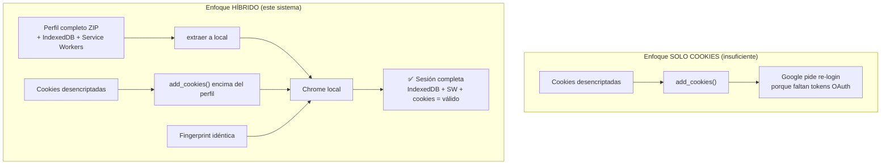

Google guarda los tokens de sesión en **IndexedDB** dentro del perfil, no en las cookies.
Copiar solo las cookies → Google no encuentra los tokens → pide contraseña. Copiar el perfil
completo (con IndexedDB) + reinyectar las cookies desencriptadas encima = sesión válida.

---

## 7. Cómo no ser detectado por Google

Google identifica dispositivos por una combinación de señales ("fingerprint"). El objetivo es
que **todas las PCs de la LAN parezcan el mismo dispositivo**.

### Las capas del fingerprint

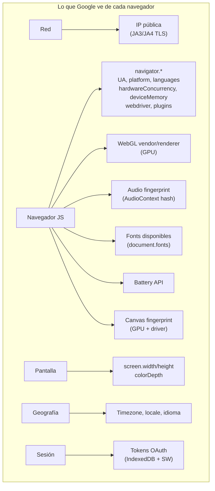

### Qué hace el sistema con cada capa

| Capa | Técnica de spoofing | Coherencia |
|---|---|---|
| **navigator.\*** | `init_script()` reescribe UA, platform, languages, hardwareConcurrency, deviceMemory, plugins, webdriver | ✅ Mismo en todas |
| **WebGL** | Intercepta `getParameter(37445/37446)` → GPU del servidor | ✅ Mismo GPU reportado |
| **Audio** | `OfflineAudioContext.getChannelData` → ruido deterministic; `sampleRate` = 44100 | ✅ Mismo audio hash |
| **Fonts** | `document.fonts.check` → solo set común (Arial, Calibri...) | ✅ Mismo conjunto |
| **Battery** | `navigator.getBattery` → valor fijo (charging=true, level=1) | ✅ Mismo estado |
| **Canvas** | **NO se toca** (rompería imágenes de Gemini) | ⚠️ Depende del hardware |
| **Screen** | Spoofeado a 1920x1080/24bit | ✅ Mismo |
| **Timezone/locale** | Forzado vía Playwright context (America/La_Paz, es-419) | ✅ Mismo |
| **sec-ch-ua** | Dinámico + reconciliado a versión local de Chrome | ✅ Coherente con binario |
| **Tokens OAuth** | Perfil completo copiado (IndexedDB + SW) + cookies reinyectadas | ✅ Válidos |

### El init_script: la "inyección" anti-detección

Cuando el cliente abre Chrome, inyecta un script JS en **cada página** antes de que cargue,
vía `context.add_init_script()`. Este script reescribe propiedades de `navigator`, intercepta
WebGL, AudioContext, fonts, battery, etc. para que todas las PCs reporten los mismos valores.

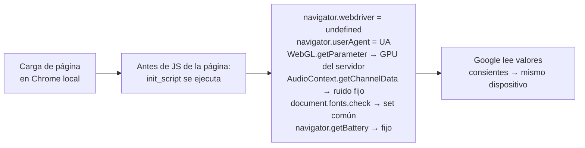

---

## 8. Cobertura anti-detección (qué cubrimos)

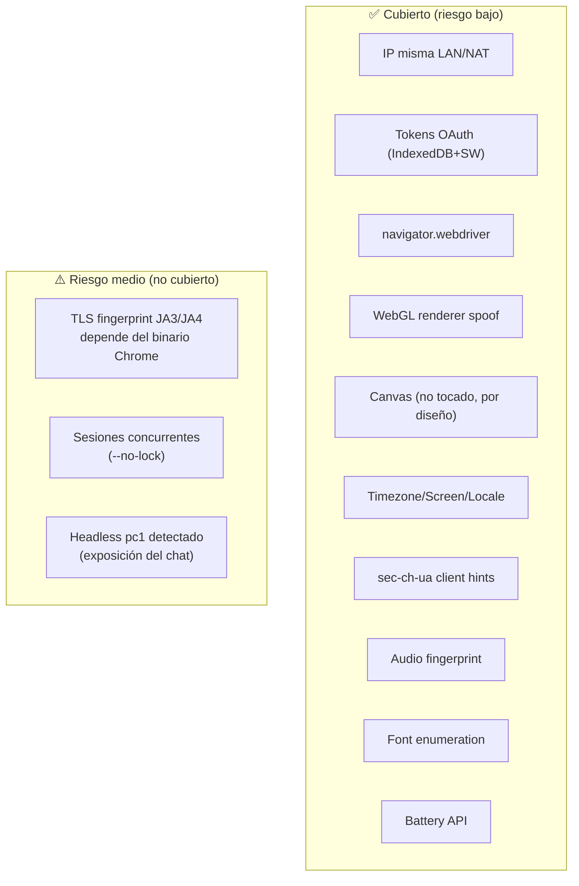

### Tabla detallada de cobertura

| Vector | Cubierto | Implementación | Riesgo |
|---|---|---|---|
| **IP pública (misma LAN)** | ✅ | NAT → mismo IP | Bajo |
| **Tokens OAuth** | ✅ | Perfil completo + cookies inyectadas | Bajo |
| **`navigator.webdriver`** | ✅ | Patchright CDP + init_script | Bajo |
| **WebGL renderer** | ✅ | Intercept `getParameter` | Bajo |
| **Canvas fingerprint** | ✅ (no tocado) | Por diseño (preserva Gemini) | Bajo |
| **Timezone/Screen/Locale** | ✅ | Playwright context | Bajo |
| **sec-ch-ua** | ✅ | Dinámico + `reconcile_chrome_version` | Bajo-medio |
| **Audio fingerprint** | ✅ | `AudioContext`/`OfflineAudioContext` valores deterministic | Bajo-medio |
| **Font enumeration** | ✅ | `document.fonts.check` restringido | Bajo |
| **Battery API** | ✅ | `getBattery` valor fijo | Bajo |
| **TLS fingerprint (JA3)** | ❌ | Depende del binario Chrome | **Medio** |
| **Sesiones concurrentes** | ⚠️ | `--no-lock` las permite | **Medio** |
| **Headless pc1** | ⚠️ | Solo CDP local | Medio |

---

## 9. Lo que NO cubrimos (y si se puede cubrir)

### 9.1 TLS fingerprint (JA3/JA4) — NO cubierto

**Qué es**: El handshake TLS inicial que hace Chrome depende de su versión + librería TLS.
Distintas versiones de Chrome → distintos JA3. Google puede loguear JA3 y correlacionar.

**Por qué no se cubre**: El JA3 viene del **binario de Chrome**, no se puede spoofear desde JS.
La única forma de controlarlo es usar la **misma versión de Chrome** en todas las PCs.

**¿Se puede cubrir?** Parcialmente: mantener todas las PCs en la misma major version de Chrome.
`reconcile_chrome_version()` ajusta el **UA** pero no el JA3 real.

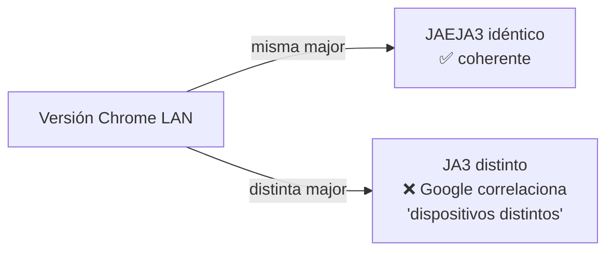

**Acción**: activar auto-updates de Chrome en todas las PCs; idealmente todas con la misma
versión major que el servidor.

### 9.2 Sesiones concurrentes (mismo IP) — mitigado, no eliminado

**Qué es**: Si 2+ PCs en la misma LAN abren Gemini a la vez con `--no-lock`, Google ve la
misma cuenta activa en "2 navegadores simultáneos" (distintos session tokens).

**¿Es ban?** No. Google permite sesiones concurrentes desde el mismo IP (familia/oficina).
Pero puede aparecer un "verify it's you" ocasional. **No es ban**, es un challenge.

**¿Se puede cubrir?** El sistema de turnos (`/lock`) lo elimina: solo una PC a la vez. Pero si
quieres uso simultáneo, el riesgo es bajo en misma LAN (mismo IP).

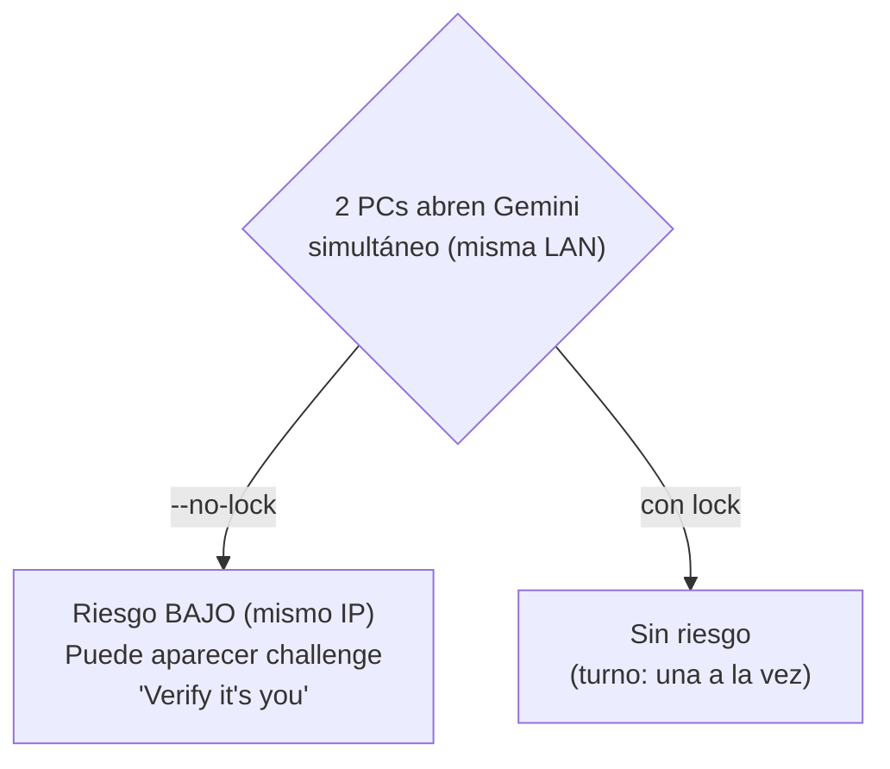

### 9.3 Canvas fingerprint — NO cubierto (por diseño)

**Qué es**: El canvas fingerprint depende de la GPU + driver físicos. PCs con GPUs distintas
→ distinto canvas hash, aunque WebGL renderer esté spoofeado.

**Por qué no se cubre**: Si se spoofea el canvas, **se corrompe la generación de imágenes y
videos de Gemini** (Gemini dibuja en canvas). Por diseño se deja intacto.

**¿Se puede cubrir?** Técnicamente sí (añadir ruido al canvas), pero **rompería Gemini**.
No se cubre deliberadamente.

### 9.4 Headless de pc1 (chat) — NO cubierto

**Qué es**: pc1 corre Chrome `--headless=new` para el chat. Google puede detectar headless
(vía timing, propiedades del renderer, etc.).

**¿Se puede cubrir?** Parcialmente: `CHROME_HEADLESS=false` abre pc1 visible (útil para
depurar). Patchright tiene anti-detección, pero hay riesgo residual de que Gemini bloquee
respuestas en headless.

**Impacto**: solo afecta al chat, no al cliente (que abre Chrome visible).

### 9.5 Headless detection por Gemini — riesgo residual

Gemini podría pedir "verificar que eres humano" en pc1 porque detecta headless. Esto no afecta
a los clientes (que usan Chrome visible), solo al chat.

**Mitigación**: `CHROME_HEADLESS=false` para depurar; Patchright aplica anti-detección CDP.

---

## 10. Lo que NO debes hacer (reglas operativas)

### 🚫 Peligroso (puede causar ban o challenge)

| No hagas | Por qué | Alternativa |
|---|---|---|
| Usar el cliente desde **otra red** (IP pública distinta) **sin lock** | Google ve la misma cuenta desde 2 IPs simultáneas → señal clásica de cuenta comprometida | Siempre usar `--lock` (sin `--no-lock`) si las PCs están en redes distintas |
| Abrir Gemini en **muchas PCs simultáneamente** sin turnos | Igual cuenta, múltiples navegadores activos a la vez → challenge | Si necesitas simultáneo, limitarlo a 2 en misma LAN |
| Dejar versiones de Chrome **distintas** entre servidor y clientes | Mismatch UA vs JA3 → Google correlaciona dispositivos | Mantener todas en la misma major version |
| Compartir el `.env` con el `AUTH_TOKEN` por canales inseguros | El token protege la API de sesión | El token es solo LAN; no exponer fuera |
| Abrir master con Chrome manualmente mientras el servidor corre | Genera lock files que impiden al servidor leer master | Usar `chrome_start_master.bat` **solo** cuando el servidor esté detenido |

### ⚠️ Precaución (puede causar challenge, no ban)

| Ten cuidado | Por qué | Mitigación |
|---|---|---|
| Usar `--no-lock` en LANs con PCs que no controlas | Si alguien abre Gemini en otra LAN con tu perfil, hay 2 IPs | `--no-lock` solo en LAN propia y de confianza |
| Dejar el cliente abierto muchas horas | Las cookies inyectadas se vuelven stale (el perfil IndexedDB sigue válido) | Re-ejecutar `client.py` o usar `--force` |
| Actividad "automatizada" obvia (clicks a velocidad inhumana) | Google detecta bots | El sistema no automatiza; es uso humano normal |
| GPUs muy distintas entre PCs | Canvas fingerprint difiere naturalmente | Aceptar el riesgo residual (bajo) |

### ✅ Buenas prácticas

| Haz | Beneficio |
|---|---|
| `--refresh` al arrancar el servidor si cambiaste la sesión de master | Recopia master a pc1 con datos frescos |
| `--force` en cliente si Google pide login | Re-descarga perfil y cookies frescas |
| Mantener Chrome actualizado en todas las PCs (misma major) | JA3 coherente |
| Usar `--lock` si hay IPs públicas distintas | Evita multicuenta-detect simultáneo |
| Reiniciar el servidor si pc1 cae (watchdog lo hace solo cada 10s) | Chat disponible |

---

## 11. Gestión de riesgos: ban vs challenge

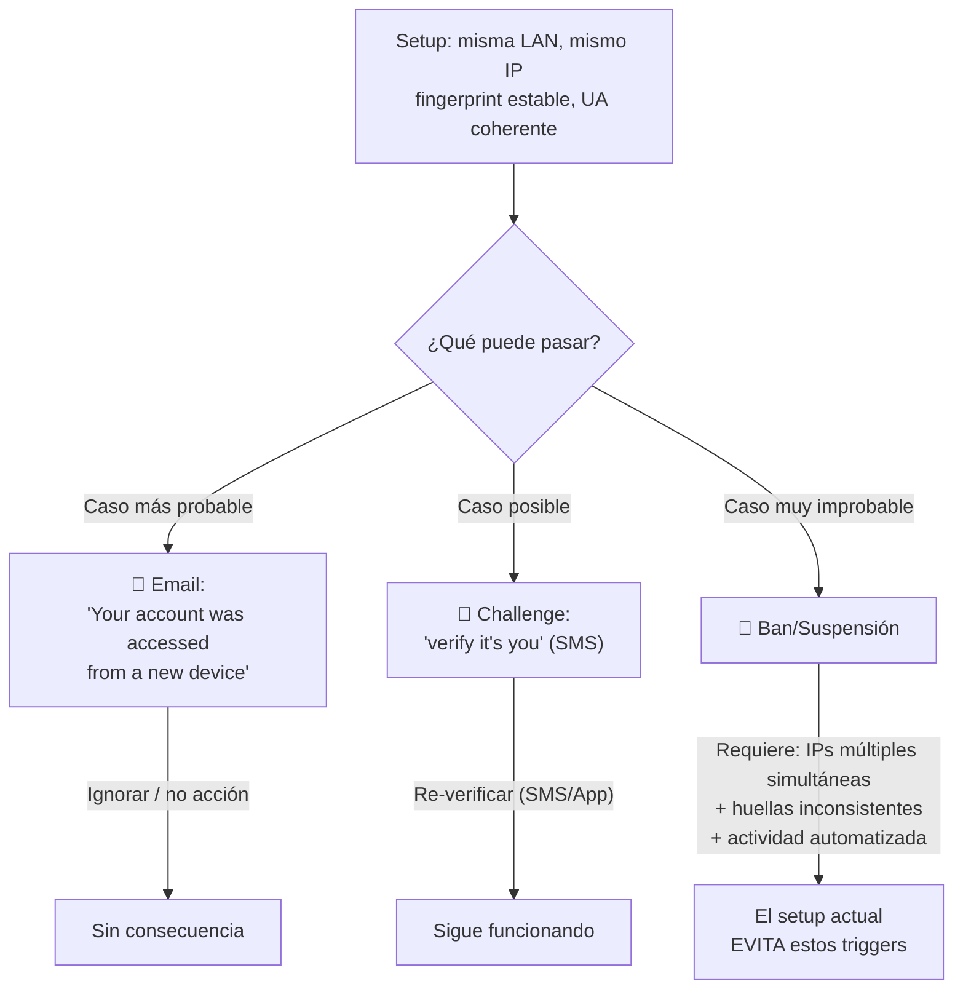

### La verdad honesta

| Evento | Probabilidad con este setup | Consecuencia |
|---|---|---|
| **Email "nuevo dispositivo"** | Media (al primer uso desde una PC nueva) | Nada. Solo notificación. |
| **Challenge "verifica tu identidad"** | Baja-media (ocasional) | Re-verificar con SMS/app. Sigue funcionando. |
| **Ban/suspensión** | Muy baja | Requeriría 2+ IPs públicas simultáneas + actividad automatizada obvia. El setup evita eso. |

**El setup actual no está diseñado para evadir un ban agresivo de Google** — está diseñado para
**uso compartido legítimo en una LAN familiar/oficina**, donde Google ya permite sesiones
múltiples. El riesgo realista es un "challenge" ocasional, no una suspensión.

---

## 12. Checklist de operación segura

### Antes de empezar (setup inicial)

- [ ] La PC servidor tiene la sesión de Google activa en Chrome (abrir master con `chrome_start_master.bat`, loguearse, **cerrar** el navegador)
- [ ] `pyright install chromium` o Chrome oficial instalado en el servidor
- [ ] Todas las PCs cliente tienen Chrome oficial instalado **con auto-updates activados**
- [ ] `.env` configurado con `AUTH_TOKEN` y `GEMINI_CDP_PORT=19230`

### Al arrancar el servidor

- [ ] `python server.py` (o `--instances 0` para solo API sin chat)
- [ ] Verificar `GET /health` responde (sin token)
- [ ] Verificar `curl "/storage_state?token=TOKEN"` devuelve cookies (con SID/1PSID)
- [ ] Si master cambió: `python server.py --refresh`

### Al usar un cliente

- [ ] `python client.py http://SERVIDOR:8000` (usar `--no-lock` solo si todos están en la misma LAN)
- [ ] Si Google pide login → `--force` + `--refresh` en servidor
- [ ] Si versión de Chrome local difiere del servidor → el sistema reconcilia automáticamente (ver log "Chrome local detectado: vNNN")
- [ ] Si hay challenge "verify it's you" → re-verificar con SMS, luego seguir (no es ban)

### Al terminar

- [ ] Cerrar el navegador del cliente (libera el turno automáticamente si no era `--no-lock`)
- [ ] El servidor puede quedarse corriendo (watchdog mantiene pc1)

### Mantenimiento

- [ ] Periódicamente: abrir master con `chrome_start_master.bat`, verificar que la sesión sigue activa, cerrar
- [ ] Si Google renueva la cuenta (cambio de contraseña) → re-loguear master + `--refresh`
- [ ] Mantener todas las PCs en la misma major version de Chrome (auto-updates)

---

## Resumen visual final

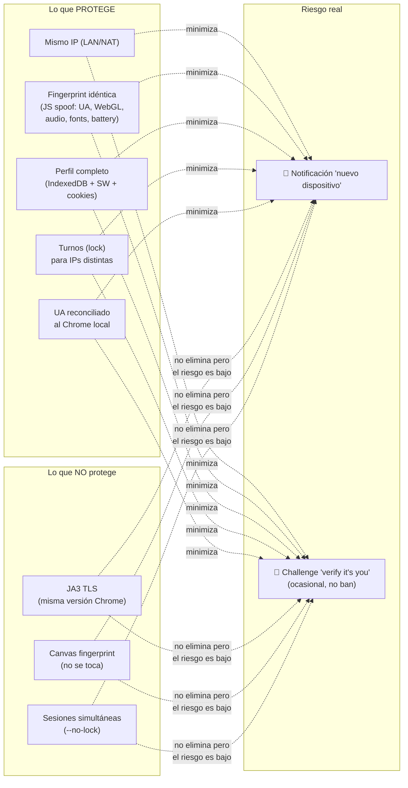

> **Conclusión**: El sistema minimiza la detección pasiva de Google manteniendo un fingerprint
> estable y coherente entre todas las PCs. El riesgo realista es un challenge ocasional (no
> ban), mitigado por uso de la misma LAN/dirección IP de salida. Las brechas no cubribles (JA3,
> canvas) son de fingerprinting de red/hardware que Google usa para correlación, no para
> suspensiones automáticas de cuentas de Gemini.
